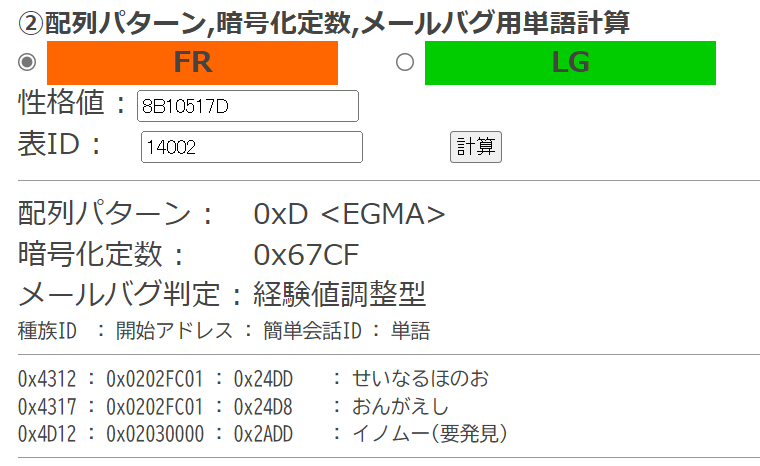
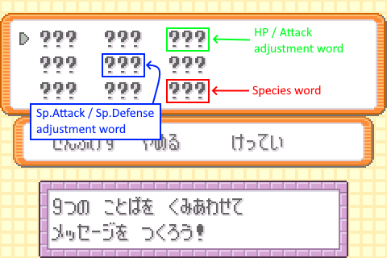

## Preamble

Unlike the mail glitch in Western FRLG, Japanese FR/LG’s mail glitch writes to an area that comprises all of substructure 2, and small bits of substructures 3 and 4.
This means that obtaining glitch Pokémon is going to be a different process as we cannot swap substructures, instead having to edit the substructure and carefully managing the checksum to turn a regular Pokémon into a grab ACE Pokémon.

This setup requires acquiring a specific Pokémon (which depends on your save’s variables) and adjusting the stats in a way that when two words of the “mail” is edited (one for the species and the other for the stats that are adjusted), the checksum is preserved and the Pokémon becomes a glitch Pokémon.

However not all of the grab ACE species act in desirable ways so usually after converting the Pokémon into an ACE species, a code is executed to generate a Pokémon with index number `0xFFC9`.
This species’ name overwrites the `monPlaceChangeFunc` pointer to a RAM address located around Box 12, Slot 29 in the Pokémon Storage System (`0x027F027F` to be exact).
The address has bit 0 set, meaning that a `BX` branch into that address will result in the data located there being interpreted as Thumb machine code rather than ARM machine code.
This is beneficial for the Japanese games as Thumb is a more compact instruction set (16-bit width) compared to the ARM instruction set (32-bit width), combined with the character set allowing almost all of the 8-bit bytes to be written, it is more efficient to use the Thumb instruction set in this case.

## Getting a suitable Pokémon

In summary we are using a Pokémon with a specific PID for the mail corruption.
The Pokémon has the following characteristics:

*   PID mod 24 must be equal to one of the below values
    +   8 or 22 if adjusting the checksum with effort values (EVs).
    +   6, 7, 12, 13, 18, or 19 if adjusting the checksum with experience.
    +   This is the PID substructure order, these specific substructure orders expose the species field, and either the experience or EVs field under mail corruption.
*   (PID<sub>LOW</sub> ^ TID ^ i) must be equal to an index number of a writable easy chat system word.
    +   i is the index number of the target species.
    +   ^ is the bitwise XOR operation.

We can obtain this Pokémon either through catching a random Pokémon then check its PID or we can use RNG manipulation to guarantee us a suitable Pokémon.

### Obtaining without RNG manipulation

If we are obtaining this through catching a random Pokémon, we will need to have the PID of the Pokémon we caught.
An easy way to get this is calculating the IVs of the Pokémon and then inputting the IVs and the Pokémon's nature into something like [PokéFinder](https://github.com/Admiral-Fish/PokeFinder)'s IVs to PID tool to get back the PID.
The tool outputs a PID along with an associated 'Method' that the Pokémon was generated with. Below is a rough guide (sourced from Blisy's retail RNG Discord) of the most common methods to generate a Pokémon's PID and IVs:

**Method 1**

*   Starters
*   Fossils and gift Pokémon
*   Static encounters
*   Roaming Pokémon

**Reverse Method 1**

*   Unown
*   Box R/S Zigzagoon

**Method 2**

*   Event gift Pokémon

**Wild**

*   **Method 1**: FireRed/LeafGreen and Ruby/Sapphire
*   **Method 2**: Emerald
*   **Method 4**: Fishing

!!! important
    Please check other the associated PIDs of other Methods if it turns out that the reported PID is not the caught Pokémon's PID.
    Generally the reported PID is wrong if writing the glitch mail in step III results in a `Bad EGG`.
    If the encounter type is not listed under a 'reverse' Method, it will never be generated under a 'reverse' Method, and vice versa.

### Obtaining with RNG manipulation

!!! note
    At this moment it is highly recommended to check if the PID will return results in the tool linked at [Getting information about the PID](#getting-information-about-the-pid) before RNG manipulation.
    This is due to the Japanese tool removing a few easy chat system words presumably for simplicity but the RNG tool calculates targets with the removed words in mind.

We can select a target Pokémon with a PID is guarantted to satisfy the above conditions through RNG manipulation.
To do this, we use the [Donor Search webtool](https://it-is-final.github.io/jp-frlg-mail-donor-searcher/).

1. Select a seed you are aiming to get the target Pokémon from
2. Input the data into the tool (Game version, encounter type, TID, seed, initial advances, advances, and delay (set to 0 if you are not using Lua scripts to RNG manipulate))
    + 'Advances' can be translated as 'Max Advances' in PokéFinder
    + 'Advances' generally does not need to be set to a value greater than 100, there are a lot of target Pokémon whose PID is suitable for this setup.
4. It should output a list of advances with their associated PID, select an advance then perform an RNG manipulation to obtain the Pokémon on that advance.

### Getting information about the PID

!!! note
    I am working on an English tool for this, and the original Japanese tool notably leaves out a few words from the easy chat system that should be there as well as their word groups.
    If anything you RNG manipulated returns no results, it is because those PIDs were calculated with the removed easy chat system words in mind, for now pick a different PID.

1. Go to tool labeled under ② at [this page](http://detelony.blog.fc2.com/blog-entry-29.html).
    +   Unfortunately at the time of writing (2025-05-04), the website where this tool is located is still not secured with HTTPS, you just have to ignore all of the warnings about it being insecure.
2. Select the correct game
3. Input the PID under “性格値”
4. Input the TID under “表ID”
5. Click on the button labeled “計算”

Results should populate as shown below:


If no results show underneath the tool, that means you need to use a different Pokémon.

Take note of the below fields:

*   “暗号化定数” is the encryption key, the Japanese tool autofills it but you should still take note of it
*   “メールバグ判定” is the adjustment type, it can have one of three values:
    +   経験値調整型 is Experience adjustment type
    +   努力値調整型 is EV adjustment type
    +   使用不可 is no adjustment type, you should use a different Pokémon if you get this
*   Underneath the “種族ID” column in the table is the index numbers of the available glitch Pokémon, take note of the one with the lower index value (usually means less adjustment)
*   Underneath the “簡単会話ID” column in the table is the index numbers of the corresponding easy chat words for the glitch Pokémon and with it the “単語” column consists of the corresponding word for the index
    +   This is your species word, use the word that corresponds to the glitch species you took note of earlier

## Getting our adjustment numbers

!!! warning
    You should probably save before performing any of the following actions, that way you have a recovery point in case of future mistakes.
    Do not perform any later saves until you have `0xFFC9` in step IV.

1.  Go to tool labeled under ③ at [this page](http://detelony.blog.fc2.com/blog-entry-29.html).
2.  Write the index of your glitch Pokémon in the “バグポケモンID” textbox or use the dropdown box which is prepopulated with the results from the previous step
3.  “材料ポケモンID” is the index of the base Pokémon, if you know its index number (and it must be in hex) write it in the textbox, else the Japanese names can be selected in the dropdown box
4.  In the dropdown box for “簡単会話ID”, select “全単語総当たり” to be presented with every possible option, or input the index number of the easy chat word you want to use as the checksum word in the textbox
    +   There are more words in the dropdown menu for specific word groups, you can also use them for convenience as your checksum word
5. Click on the button labeled “計算”

If you chose to let it present you with every possible easy chat word, a window should open with the easy chat words along with the adjustment to make.
Note down a word of your choosing and its associated adjustment value, this is the checksum word.

If you chose an individual word, the adjustment value appears below the tool.

For Pokémon who need to be EV adjusted, the adjustment will be in the following template

```
H###A### or C###D###
```

These are the Japanese EV notations and below is a quick guide to what each letter means:

*   H: HP
*   A: Attack
*   B: Defense
*   C: Sp.Attack
*   D: Sp.Defense
*   S: Speed

This tells you the EVs that your Pokémon must have before corruption.

For Pokémon who needs to be experience adjusted, the adjustment will be in the following template:

```
_____ or ______ … (以降+65536)
```

The first one is your base adjustment value.
If your Pokémon’s experience is greater than the adjustment value, then add 65536 to it until it is greater than your Pokémon’s experience points.
The new adjustment value is the experience value your Pokémon must have before corruption.

## Writing glitchy mail

Perform the mail glitch like how it is done in any other version of FRLG.
Then when you get to writing the glitchy mail, make sure that the Pokémon that will be converted is in Box 3, Slot 1.
Where to write each word depends on the adjustment type and how you chose to adjust the Pokémon.

*   **Experience-adjusted Pokémon**: The species word must be in the 3rd slot, and the adjustment word in the 5th slot.

    { width="300" }

*   **EV-adjusted Pokémon (all)**: The species word must be in the 9th slot
    +   **HP / Attack**: The adjustment word must be in the 3rd slot
    +   **Sp.Attack / Sp.Defence**: The adjustment word must be in the 5th slot

    { width="300" }

Once you have written the glitchy mail, check Box 3 again, a decamark should have appeared in the Pokémon's place.

!!! important
    If a bad EGG appeared in the Pokémon's place it can be caused by one of the following:

    - The words are in the wrong word slots of the glitchy mail
        - If you have saved prior to performing the mail writing, go back and double check the word placement before writing.
          Otherwise it may be the other cases.
    - The Pokémon is not adjusted correctly
        - If you have saved prior to performing the mail writing, depending on the adjustment type do the following.
            - **Experience-adjusted Pokémon**: If the experience is over the what the adjusted experience should be, go back to step II and recalculate with the new experience.
              Otherwise add more experience until it is equal to what the adjusted experience should be.
            - **EV-adjusted Pokémon**: If you have not been tracking your EVs properly, you must start back to step II or if you saved after performing step II, you must start all over again.
    - The reported PID used as the Pokémon's PID in the tool is not the Pokémon's PID
        - This case only happens if the donor Pokémon is not obtained via RNG manipulation, in this case, start back at step I and either catch a different Pokémon or use another PID reported in the 'IVs to PID' tool as the Pokémon's PID.

## Getting `0xFFC9`

While we now have a glitch Pokémon, we generally only use this to create another glitch Pokémon that will actually execute most codes we want.
This is because:

*   The value that ends up overwriting the `monPlaceChangeFunc` pointer is located too early or too late within the boxes
*   Whether the data in the PC ends being interpreted as ARM or Thumb machine code is not certain.
*   Some of the glitch species cause strange graphical glitches when they are swapped.

To mitigate this, we will create a glitch Pokémon with index number `0xFFC9` with the code below:

```
Box  1: リ び ‥ o く _ ゼ n	[リび‥oく ゼn]
Box  2: _ ‥ t ま _ 1 t ほ	[ ‥tま 1tほ]
Box  3: ぁ m _ _ あ い	[ぁm  あい]
Box  4: ア B ぢ い い N	[アBぢいいN]
Box  5: O	[O]
```

!!! important
    Graphical glitches are to be expected when creating `0xFFC9`.
    You can tell if you are still able to replace the Pokémon to another place and exit the PC afterwards.

    However if the swap action crashes the game instead, then something has gone wrong and it could be caused by:

    *   You have written the code wrong
        +   Double check every character, especially for the small kana such as `ぁ` vs `あ`
    *   There is Pokémon or invisible Pokémon in the box slots after the entrypoint (this is shown in Step I on the glitch Pokémon list).
        +   Move them out or clear them via group select.
    *   You have the wrong Pokémon
        +   See the bad EGG notice in step III for instructions and treat the decamark as if it is a bad EGG.

If the code does not crash, then you can follow the next few instructions to clean up the boxes.
Else check the notice on what to do if the game crashes.

If you want to get rid of the other grab ACE Pokémon created from earlier, then follow the steps below:

1.  Place it in your party (should probably use the yellow hand)
2.  In the party menu, move it to the front
3.  Enter deposit mode in the PC
4.  Select the decamark using the white hand
5.  Select release and confirm

You have completed the grab ACE setup for Japanese FireRed and LeafGreen.
