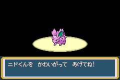
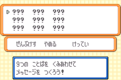

!!! important
    This method is LeafGreen only as it uses a version-exclusive trade Pokémon. 
    If you want a method that works for FireRed, check out [the main tutorial](ace-set-up.md).

This tutorial uses the method mentioned for FireRed as its basis but streamlines the steps and removes the manipulation/luck required to obtain the donor Pokémon through using a trade Pokémon, which comes with the advantage of having known and set data.

## Requirements

*   Mail glitch active on your save (you can watch [this video guide](https://www.youtube.com/watch?v=yVhK4pLC9ac) to learn how to activate it).
*   Have at least 6 Retro Mail in the bag.
    +   You might need more Retro Mail to be able to clone enough Rare Candy to be able to level ニドくん to level 41.
*   Have at least 1 Rare Candy in the bag.
*   Have the ニドくん (Nidoran♂) trade available.
    +   This trade Pokémon has a lonely nature
    +   The OT’s trainer ID is 63184.

There may be instances where you may already have ニドくん.
In this case, you must make sure that ニドくん does not have these characteristics:

*   Evolved to Nidoking.
*   Level 41 **and** unevolved (i.e. not a Nidorino).
*   Has an experience value greater than 61536.

If ニドくん has any of the “bad” characteristics outlined above, then you cannot perform this method, and you must use the normal method used in [the main tutorial](ace-set-up.md).
Otherwise below is a guide on what sections of this tutorial can be skipped if you already have ニドくん:

*   Getting ニドくん
    +   Can be skipped
*   Cloning Rare Candy
    +   This depends on ニドくん’s level and the amount of Rare Candy in your bag:
        -   If it is equal to 41, then it can be skipped entirely.
        -   If it is less than 41 and you have enough Rare Candy to level ニドくん to 41, then it can be skipped.
        -   If it is less than 41 and you do not have enough Rare Candy, then it cannot be skipped.
*   Preparing ニドくん
    +   Rare Candy section depends on ニドくん’s level:
        -   If it is equal to 41, then it can be skipped entirely.
    +   Daycare section depends on ニドくん’s experience:
        -   If it is equal to 61536, then it can be skipped entirely.
        -   If it is less than 61536, and it is an even value, then the amount of steps to take is reduced.
        -   If it is less than 61536, and it is an odd value, then a different method (e.g. wild battles) must be used to increase experience to 61536 instead.
*   Corrupting ニドくん
    +   Cannot be skipped.
*   Finalising ACE
    +   Cannot be skipped.

## Instructions

### Getting ニドくん

1.  Go to the Underground Pass entrance on Route 5, and trade a Nidoran♀ with the girl.




### Cloning Rare Candy

1.  Give each member of your party (except for first member) Retro Mail, the message can be anything.
2.  Give the first member of the party Rare Candy.
3.  Then attempt to give the first member of the party Retro Mail, when you see the mail message screen it should look like this.



4.  Press `START` and confirm the mail, when you do this you notice that the party member is still holding Rare Candy but the Rare Candy amount in the bag goes up by one while the Retro Mail in the bag goes down by one.
5.  Repeat steps 3 and 4 until you have at least enough Rare Candy to level ニドくん to level 41.
    +   It might be useful to clone extra Rare Candy for your own unrelated usage.
6.  Once you are done with the Rare Candy cloning, remove the Rare Candy from the first member of the party.

### Preparing ニドくん

1.  Use Rare Candy on ニドくん until he is at level 41, make sure to evolve him to a Nidorino (but not to a Nidoking)!
2.  Once ニドくん is at level 41, go to the daycare in Route 5 (or the one in the Sevii Islands if your save is extra completed).
    +   At this point, ニドくん’s experience should be 61450.
3.  Deposit ニドくん in the daycare and walk 86 steps, ending your last step in front of the daycare man.
4.  Withdraw ニドくん from the daycare, his experience should be 61536.

    

5.  Place ニドくん into the first slot of box 3, and withdraw another box Pokémon to be the sixth party member.

    

### Corrupting ニドくん

1.  Give Retro Mail to the sixth party member, and write the following message to the mail.
    +   ポケモンゲット as the 3rd word.
    +   うう as the 5th word.
    +   All other words left untouched.
    
    

2.  Confirm the mail, then check the Box 3 again, a glitch Pokémon should take the place of ニドくん.

    

### Finalising ACE

1.  Move four party members into the boxes with the last party member to move still held by the orange hand (can be activated by pressing SELECT).
2.  Rename Boxes 1-5 to the following:

    ```
    Box  1: リ び ‥ o く _ ゼ n	[リび‥oく ゼn]
    Box  2: _ ‥ t ま _ 1 t ほ	[ ‥tま 1tほ]
    Box  3: ぁ m _ _ あ い	[ぁm  あい]
    Box  4: ア B ぢ い い N	[アBぢいいN]
    Box  5: O	[O]
    ```

3.  With a Pokémon still in the orange hand, go back to Box 3, and swap the glitch Pokémon with the Pokémon then back again.

    

4.  Exit out of Move Pokémon mode then enter deposit mode, in the third party slot there should be another glitch Pokémon in party slot 3.
    *   You should probably place it somewhere in the boxes.

    

That is it, you have setup ACE in Japanese LeafGreen!

You probably don’t want to keep the initial glitch Pokémon (created from mail glitch) in the boxes, to remove it please do the following:

1. Place the glitch Pokémon in the party (using the orange hand)
2. Exit the PC, then go to the party menu
3. Move the glitch Pokémon to the first party slot
4. Go back to the PC and enter deposit mode
5. Release the Pokémon by selecting the Pokémon then select release and confirm
